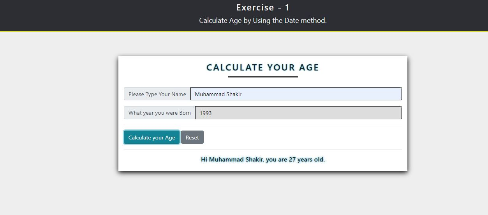

### Calculate Age
<ol>
    <li> In this exercise, I used the (Twitter Bootstrap and Vanila JavaScript). The User has to put the name otherwise it will prompt a message. <b>""Please enter the Name Field""</b>. </li>
    <li> Used the Date Method, to get the latest Year and perform the calculation based on the user response. </li>
    <li> Style The Page, So it will pretty decent </li>
    <li> Create a dynamic <b> H3 Tag - for final Output </b> </li>
</ol>
        
<strong> Final Output </strong>

