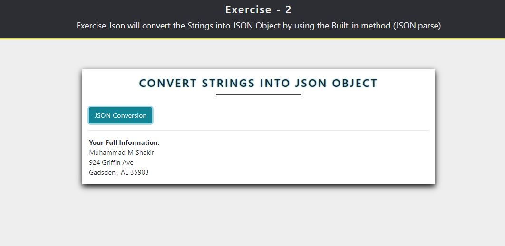
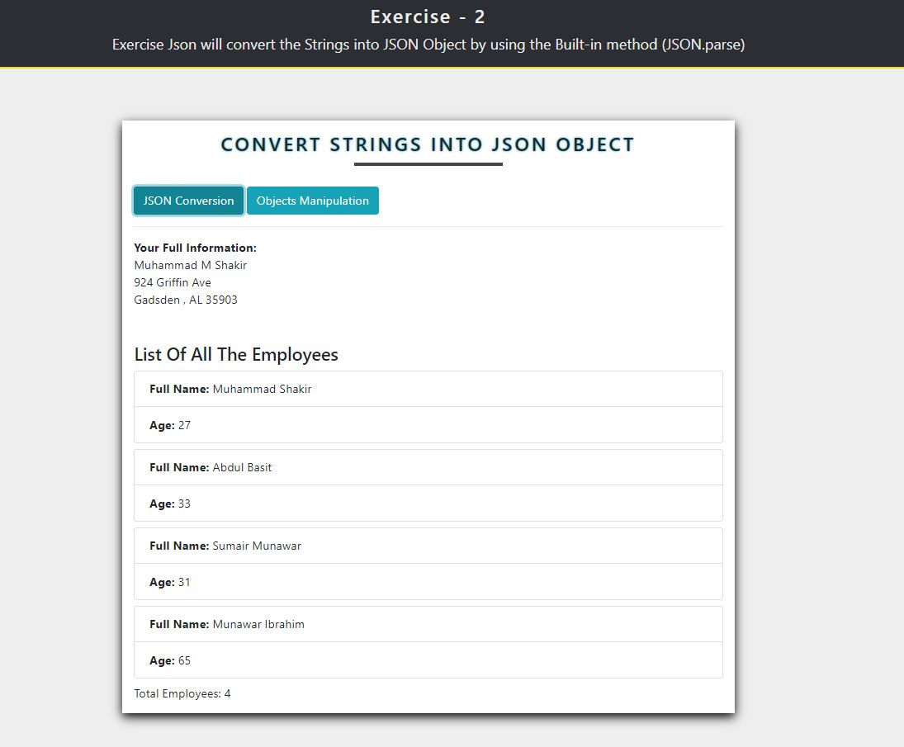

### JSON Conversion
<ol>
    <li> Convert the String into Json Object <b> by using JSON.parse </b> </li>
    <li> Worked with Json Objects and display all the objects in the UI by using For Loop. </li>
</ol>

<strong> Final Output </strong>

